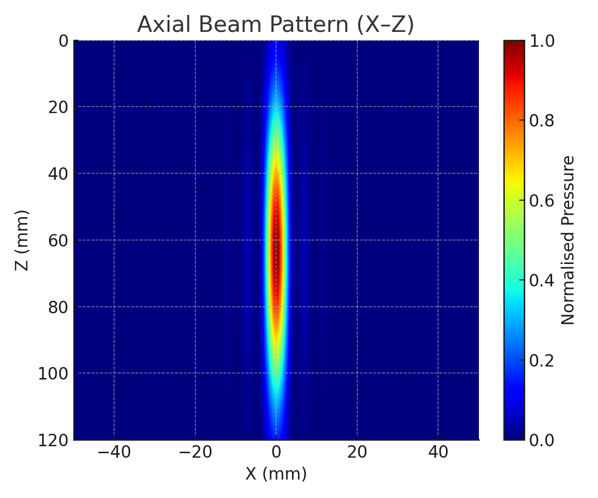
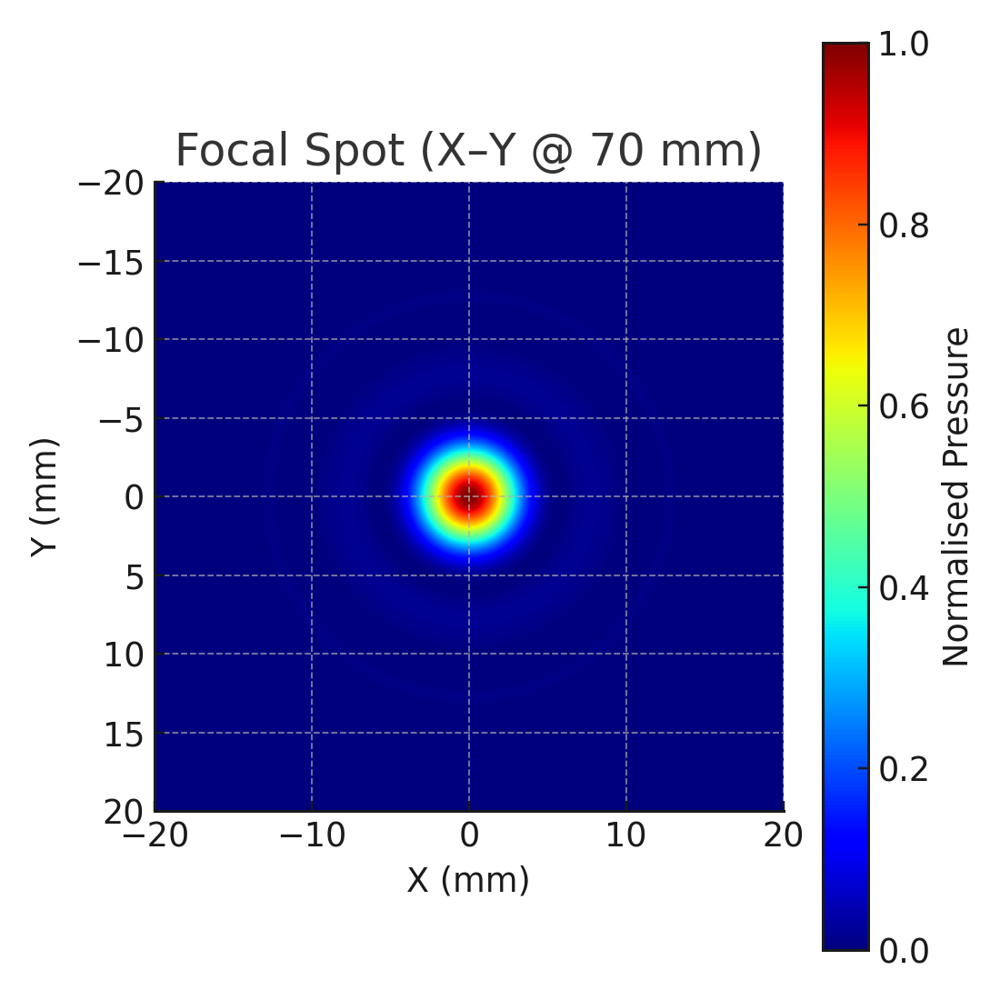
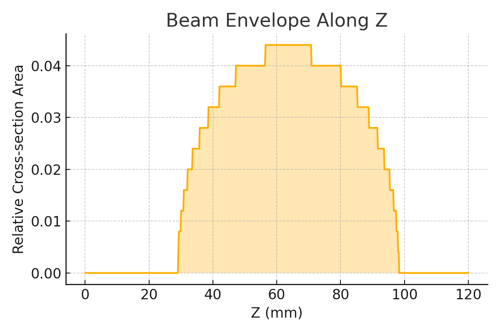

# Focused Ultrasound Beam — k-Wave 1.4

MATLAB script to simulate a **clean, tightly focused ultrasonic beam** in 3D using **time-reversal focusing**. Includes beam visualisation and optional lens export.

## Features
- **Axial beam plot (X–Z)** in *jet* colours — bright source → narrow focus → divergence.
- Focal spot (X–Y), coronal slice (Y–Z), and on-axis profile.
- Optional **lens height map** (16-bit PNG) cropped to a circular aperture + 3D surface preview.
- Configurable: frequency, focal depth, aperture, grid resolution, apodisation.

## Defaults
- Frequency: `500 kHz`
- Medium: water (1500 m/s, 1000 kg/m³)
- Aperture: `44 mm` circular, Tukey apodised
- Focal depth: `70 mm`
- Grid: `dx = 0.5 mm` (~6 PPW)

## Usage
1. Install MATLAB + k-Wave 1.4 (`addpath(genpath('k-Wave'))`).
2. Open `beam_focus_tr.m`.
3. Adjust **CONFIG** block (f0, z_f_mm, D_mm, dx, etc.).
4. Run the script.

## Example Outputs

### Axial Beam Pattern (X–Z)
Shows source at top, narrowing to high-intensity focus, then diverging.  

### Focal Spot (X–Y at Focus)
Airy-disk-like main lobe with faint rings.  

### Beam Envelope
Relative beam width vs depth.  

## Tips
- Increase PPW (reduce `dx`) for fewer sidelobes.
- Use stronger Tukey window (`r ~ 0.6–0.8`) to reduce diffraction.
- Reduce spans or coarsen `dx` if GPU memory is low.

## Requirements
- MATLAB (R2020a+ recommended)
- k-Wave 1.4
- No toolboxes required

---
MIT License. k-Wave licensed separately.
